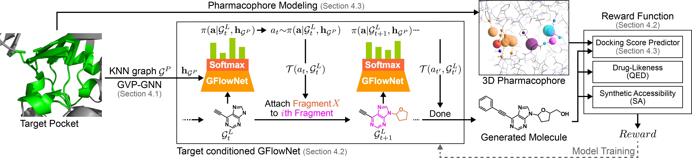

# TacoGFN: Target Conditioned GFlowNet for Structure-based Drug Design

Accepted in **_TMLR (Transaction on Machine Learning Research)_** and spotlighted in **_NeurIPS GenBio Workshop 2023_** [[**arxiv**](https://arxiv.org/abs/2310.03223)]. 

Official Github for **_TacoGFN: Target Conditioned GFlowNet for Structure-based Drug Design_** by Tony Shen, Seonghwan Seo,  Grayson Lee, Mohit Pandey, Jason Smith, Artem Cherkasov, Woo Youn Kim and Martin Ester.



We frame structure-based drug design as a Reinforcement Learning task, where the goal is to search the wider chemical space for
molecules with desirable properties as opposed to fitting a training data distribution. We propose TacoGFN, a Generative Flow
Network conditioned on protein pocket structure, using binding affinity, drug-likeliness and synthesizability measures as our reward. 

Empirically, our method outperforms state-of-art methods on the CrossDocked2020 benchmark for every molecular property (Vina score, QED, SA), while improving the generation time by multiple orders of magnitude. TACOGFN achieves −8.82 in median docking score and 52.63% in Novel Hit Rate.

If you have any problems or need help with the code, please add an issue or contact tonyzshen@gmail.com.

### Setup

Before running any scripts, please download the necessary package:

https://figshare.com/s/2738ce20d82463227113

This package includes:
- trained model weights
- pre-computed pharmacophores in lmdb
- saved pocket-graphs in lmdb
- misc files (data splitting, avg vina score, pocket centroid, generated molecules)

Set current directory into pythonpath.
```bash
export PYTHONPATH=$PWD
```

Please also setup up Conda Environment and install neccessary dependencies.
```bash
conda env create -f environment.yml
conda activate tacogfn
cd src/molvoxel
pip install -e .
```

### Training TacoGFN

If you wish to re-train the model we provide the HPS for 3 model variants
presented in our paper:

- TacoGFN: hps/crossdocked_mo_256.json
- TacoGFN (ZINCDock-15M): hps/zinc_mo_256.json
- TacoGFN no pocket conditioning: hps/zinc_mo_256_noph.json

Note: TacoGFN_ranked is the same model as TacoGFN - we just generate 500 instead
of 100 molecules at inference time, and rank by predicted docking score. The 
inference script takes care of that. 

```bash
python3 src/tacogfn/tasks/pharmaco_frag.py --hps_path "$HPS_PATH"
```

### Generating molecules and computing metrics

If you just wish to generate molecules and evaluate them, we also provide trained
models files. The following scripts re-generates molecules and computes metrics
on them (Docking needs to be computed seperatly).

```bash
bash scripts/generate_and_evaluate.sh
```

Note if you have re-trained a model, you can specify your model path to generate
and evaluate the performance. You can set $NUM_PER_POCKET to 100 for normal runs.
If you'd like to run TacoGFN_ranked, please change $NUM_PER_POCKET to 500.
```bash
python3 src/tasks/generate_molecules.py \
        --model_path "$MODEL_PATH" \
        --num_per_pocket $NUM_PER_POCKET \
        --comment "${COMMENT}"

python3 src/tasks/evaluate_molecules.py \
    --molecules_path "misc/generated_molecules/1.0_1.0_${NUM_PER_POCKET}_${COMMENT}.json"
```

### Aggregating and displaying metrics

To display the metrics, we provide the generated molecules from our model and
baseline models in misc/evaluations. The following scripts computes the metrics
used in Table 1 and Table 2:

```bash
bash scripts/see_all_results.sh
```

Note if you've generated molecules from a trained model, please compute docking 
scores using QVina 2.1 first. Then you could call the following: 

```bash
python3 src/tasks/aggergate_evals.py --eval_path "$EVAL_FILE"
```

### Citations
```
@article{
        shen2024tacogfn,
        title={Taco{GFN}: Target-conditioned {GF}lowNet for Structure-based Drug Design},
        author={Tony Shen and Seonghwan Seo and Grayson Lee and Mohit Pandey and Jason R Smith and Artem Cherkasov and Woo Youn Kim and Martin Ester},
        journal={Transactions on Machine Learning Research},
        issn={2835-8856},
        year={2024},
        url={https://openreview.net/forum?id=N8cPv95zOU},
}
```

This project modifies [**GFlowNet library for graph and molecular data**](https://github.com/recursionpharma/gflownet).
